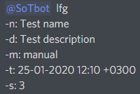
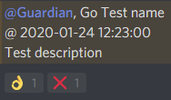
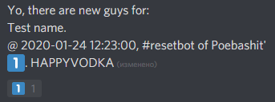
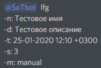
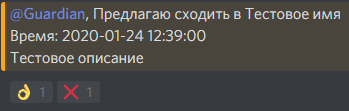
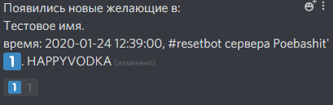

# LFG description

To get current group creation syntax mention bot with this message: `lfg -man`

## Creating a group

```
{bot mention} lfg
{[-n:][name:] {lfg name or planned activity}}
[-t:][time:]{time of the activity start, format %d-%m-%Y %H:%M %z}
[-d:][description:]{description of the activity}
[-s:][size:]{size of the group}
[-m:][mode:]{type of lfg (basic or manual)}
[-r:][role:] {names of the roles to mention, separated by ";"}
```

`%d-%m-%Y %H:%M %z` - time format, in which midnight at Moscow, Russia on February the 1st 2000 is written like `01-02-2000 00:00 +0300`

If parsing of any of the aforementioned parameters fails, the group will be created with the default values of the corresponding parameters.
The default values are:
- name is empty
- size is 1
- description is empty
- mode is basic
- time is current
- role will be "guardian" and/or "recruit" if available or @everyone

This is an example of a group creation message:



And an example of a generated message:



Use 👌 to add yourself to the list of wishing to participate. The bot should confirm your emote. To remove yourself from the group delete your 👌 reaction.

Use ❌ to delete the group (works only for the group owner).

## Managing manual groups

When someone presses 👌, the group owner will receive a message with a list of those, who wishes to participate along with some information about the group (time, channel, server):



To choose a person press the corresponding emote. The list will update. **Don't** press multiple emotes, wait for the list update.

## LFG editing

Every group has it's own ID. To get information about your LFGs message the bot in DM `lfglist`. The bot will send you the list of your groups with the following information: name, time of start, channel name, server name, **ID**.

To edit the group send a message in the channel you want the updated group announcement be in.
The command has the following syntax:

```
{bot mention} edit lfg {ID}
[parameters as in the group creation]
```

# Описание LFG-функционала

Для получения в ЛС актуального синтаксиса команды упомяните бота с таким сообщением: `lfg -man`

## Создание группы

Для создания группы отправьте сообщение-команду в том канале, в котором вы хотите разместить сбор.
Команда создания группы имеет следующий синтаксис:

```
{упоминание бота} lfg
[-n:][name:] {название группы или активности}
[-t:][time:] {время начала в формате %d-%m-%Y %H:%M %z}
[-d:][description:] {описание планируемого, указание длительности (по желанию)}
[-s:][size:] {размер группы}
[-m:][mode:] {тип подбора (basic или manual)}
[-r:][role:] {названия упоминаемых ролей, разделенные ";"}
```

Следует отметить, что имя каждого параметра пишется строго в соответствии с описанием, вплоть до знаков препинания. Например, за название сбора отвечает параметр `name:` или `-n:` (сокращенный вариант). Для полного имени параметра обязательно двоеточие в конце, для сокращенного варианта обязательно начало на дефис и окончание двоеточием. Параметры нужно писать в **разных строках**

`%d-%m-%Y %H:%M %z` - формат времени, в котором полночь по МСК 1 февраля 2000 года будет записана, как `01-02-2000 00:00 +0300`.

При возникновении ошибок парсинга любого параметра используются стандартные значения:
- name - пустая строка
- size равен 1
- description - пустая строка
- mode - basic
- time выбирается текущее
- role выполняется попытка найти роли "guardian" и "recruit", если их нет, то упоминается @everyone

Это пример сообщения-команды для создания сбора:



И пример сгенерированного сбора:



Нажмите 👌 для добавления себя в список желающих. Бот должен подтвердить реакцию сообщением в ЛС, только в этом случае вы можете быть уверены в успешном добавлении. Для удаления себя из списка желающих уберите 👌.

Нажмите ❌ для удаления сбора (работает только для создателя сбора).

## Управление группами с manual-режимом

Когда кто-то нажимает 👌, автор сбора получит в ЛС сообщение со списком желающих и информацией о сборе (время, канал, сервер):



Для выбора участников среди желающих нажмите соответствующую реакцию-цифру. Список желающих обновится автоматически. **Не нажимайте несколько реакций до обновления списка**, дождитесь его обновления.

## Изменение группы

Все группы имеют уникальный идентификатор. Чтобы получить информацию о созданных вами группах, напишите в ЛС боту `lfglist`. Ответом будет список ваших групп с информацией о них в таком порядке: имя группы, время начала, название канала, название сервера, **идентификатор группы**.

Для редактирования группы отправьте сообщение-команду в том канале, в котором вы хотите разместить обновленный сбор.
Команда создания группы имеет следующий синтаксис:

```
{упоминание бота} edit lfg {идентификатор группы}
[параметры, как при создании группы]
```